# Static Website Hosting on Azure with Front Door & Custom Domain

This project demonstrates how to host a static website on **Azure Blob Storage**, accelerate and secure it with **Azure Front Door**, and serve it through a **custom domain** with HTTPS.

**Tech stack:** Azure Storage (Static Website) · Azure Front Door · Custom Domain · DNS (CNAME + TXT records)

---

## Architecture

```
User Browser
     │
     ▼
www.mustydevops.com.ng  (CNAME → mustyfrontdoor.azurefd.net)
     │
     ▼
Azure Front Door (mustyfrontdoor)
     │  Global CDN, routing, HTTPS termination
     ▼
Azure Blob Storage — Static Website
(mustystorage.z13.web.core.windows.net)
     │
     ▼
$web container (index.html, 404.html, css/, js/, assets/)
```


---

## Prerequisites

- An active Azure subscription
- A registered custom domain (e.g. `mustydevops.com.ng`)
- Access to your domain registrar's DNS management panel
- Website files from the [Electro Bootstrap template](https://themewagon.com/themes/electro-bootstrap/)

---

## Step 1 — Create a Storage Account in Azure

1. Go to **Azure Portal → Storage Accounts → Create**
2. Fill in the following details:

| Field | Value |
|---|---|
| Resource Group | `mustydev` |
| Storage Account Name | `mustystorage` |
| Region | `(US) East US` |
| Redundancy | Locally-redundant storage (LRS) |

3. Click **Review + Create → Create**

### Screenshot — Storage Account Overview
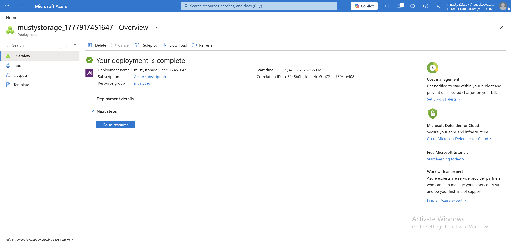

---

## Step 2 — Enable Static Website Hosting

1. Open the storage account `mustystorage` in Azure Portal
2. Navigate to **Data Management → Static website**
3. Set the following:

| Field | Value |
|---|---|
| Static website | **Enabled** |
| Index document name | `index.html` |
| Error document path | `404.html` |

4. Click **Save**
5. Copy the **Primary endpoint URL** — you will need this later (e.g. `https://mustystorage.z13.web.core.windows.net/`)

### Screenshot — Static Website Hosting Configuration
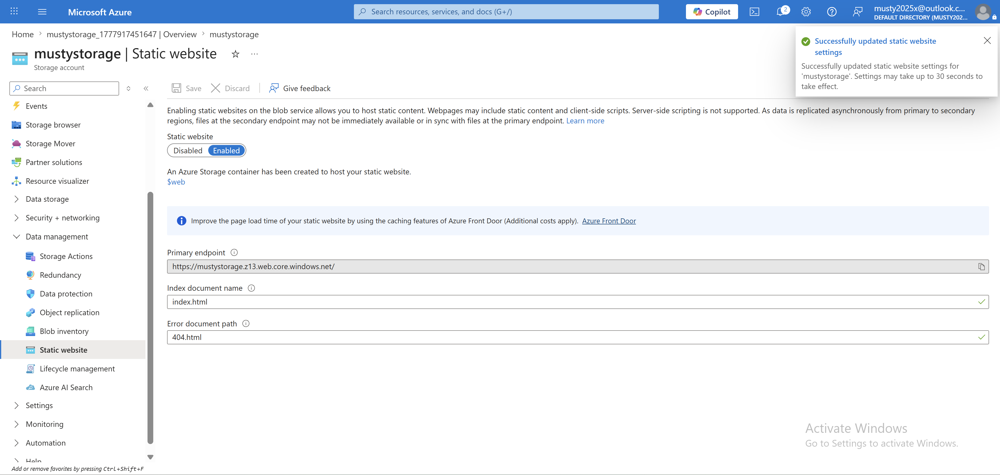

---

## Step 3 — Upload Website Files

1. In the storage account, go to **Data Management → Containers**
2. Open the **`$web`** container (auto-created when static hosting is enabled)
3. Upload all files from the cloned repository:
   - `index.html`
   - `404.html`
   - `css/` folder
   - `js/` folder
   - `asset/` folder

### Screenshot — Uploaded Files in Azure Portal
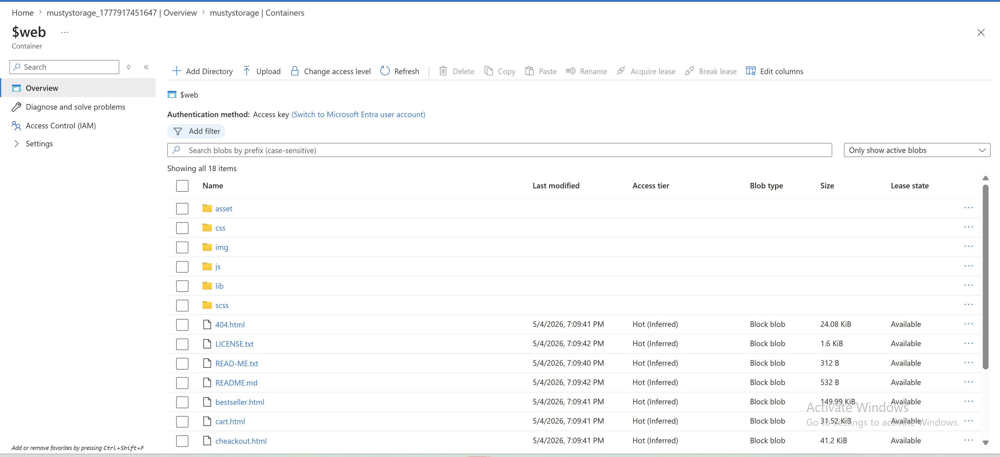

---

## Step 4 — Access Your Website

Open the primary endpoint URL saved in Step 2 in your browser:

```
https://mustystorage.z13.web.core.windows.net/
```

Your static website should now be live directly from Azure Blob Storage.

### Screenshot — Live Website
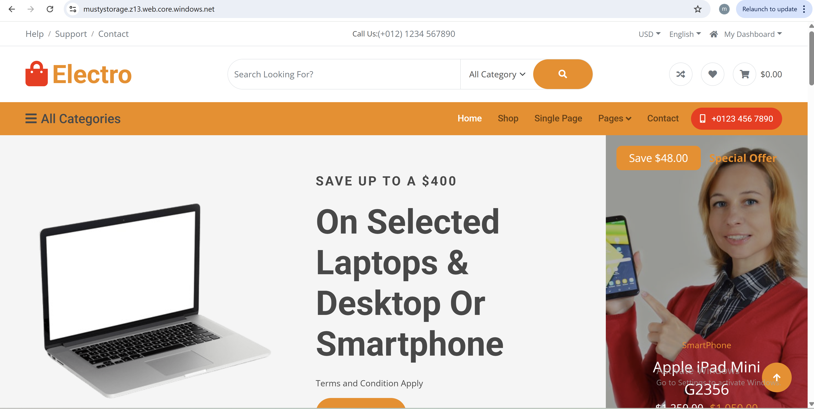

---

## Step 5 — Create Azure Front Door

Azure Front Door adds a global CDN layer, HTTPS termination, and routing rules in front of your storage endpoint.

1. Go to **Azure Portal → Create a resource → Front Door and CDN profiles**
2. Select **Azure Front Door → Quick create**
3. Fill in the following:

| Field | Value |
|---|---|
| Resource Group | `mustydev` |
| Name | `mustyfrontdoor` |
| Endpoint Name | `mustyfrontdoor` |
| Origin Type | Storage (static website) |
| Origin Host Name | `mustystorage.z13.web.core.windows.net` |

4. Click **Review + Create → Create**

### Screenshot — Front Door Configuration
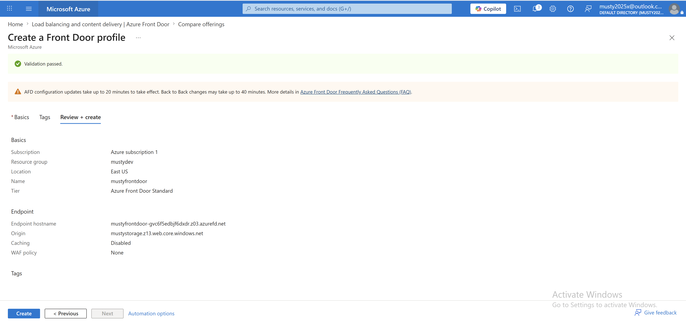

### Screenshot — Deployment Complete
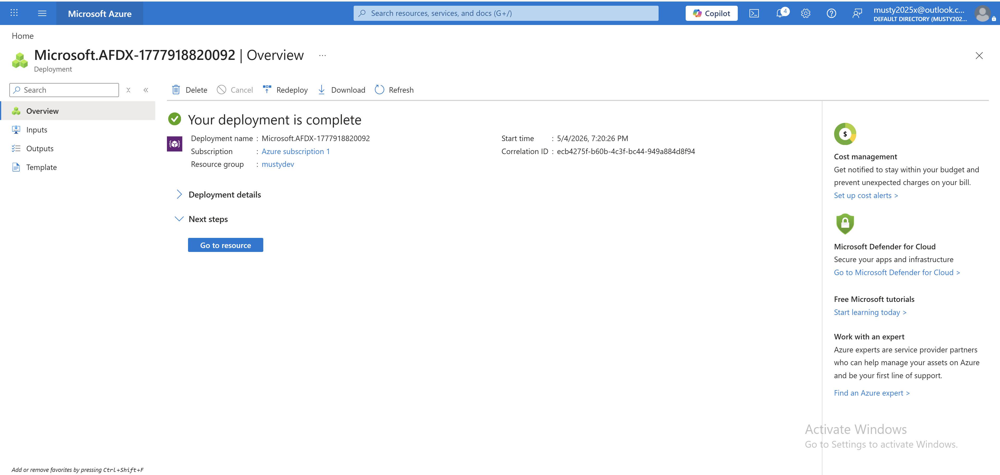

### Screenshot — Route Endpoint
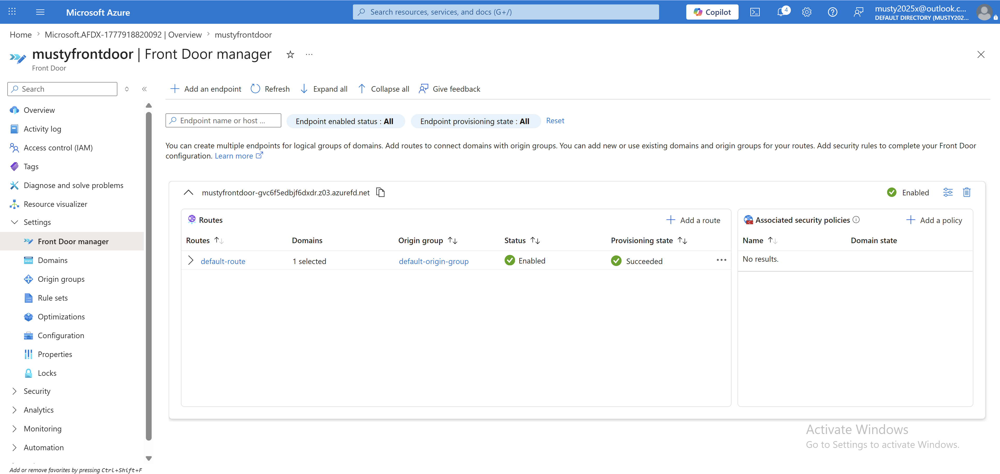

### Test the Front Door URL

> ⏳ Wait **20–40 minutes** for the Front Door deployment to fully propagate before testing.

```
https://mustyfrontdoor.azurefd.net/
```

### Screenshot — Website Live via Front Door
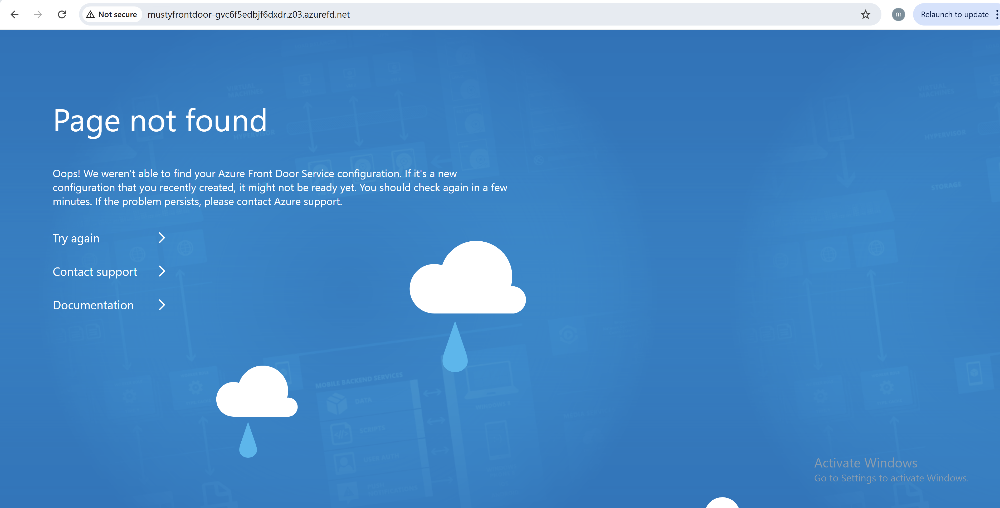
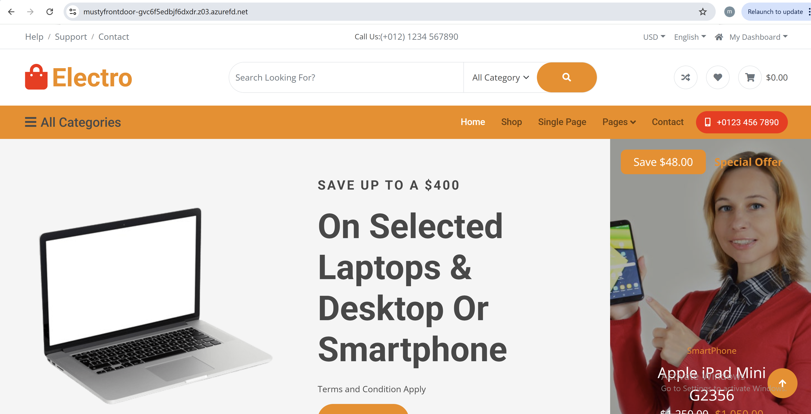

---

## Step 6 — Add a Custom Domain to Front Door

1. In the `mustyfrontdoor` resource, go to **Front Door Manager → Domains → Add a domain**
2. Fill in the following:

| Field | Value |
|---|---|
| Domain name | `www.mustydevops.com.ng` |
| Hostname | `www.mustyfrontdoor.com` |

3. Click **Add** — the domain status will show **Pending** validation

### Screenshot — Custom Domain Configuration
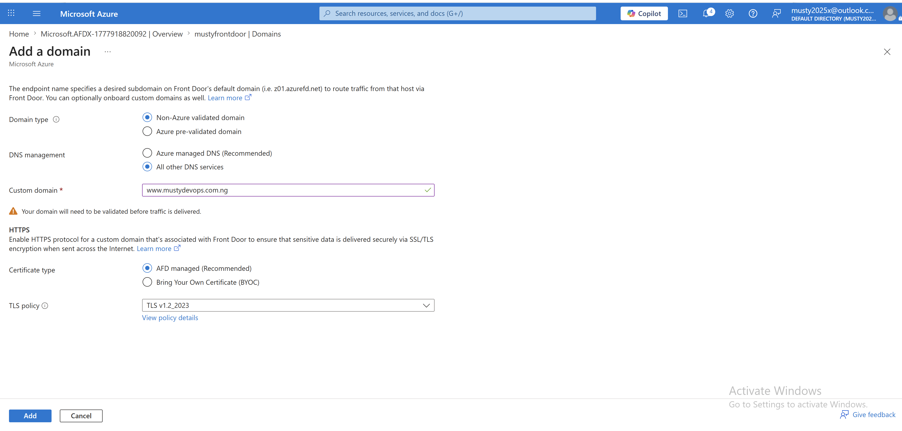

---

## Step 7 — Verify Domain Ownership via DNS

Azure requires proof of domain ownership before activating the custom domain. This is done by adding a **TXT record** at your DNS registrar.

### Add a TXT record at your domain registrar

1. Log in to your domain registrar's DNS management panel
2. Add the following record:

| Field | Value |
|---|---|
| Host / Name | `_dnsauth` |
| Type | `TXT` |
| Value | *(copy the value shown in the Azure pending status — e.g. `_ua1wvshon25z1rluwu4cj2g94z75j62`)* |

3. Save the record — DNS propagation may take a few minutes

### Screenshot — TXT Record in Domain Registrar
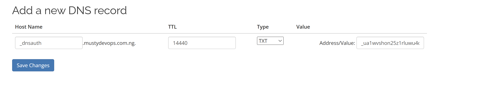

### Validate in Azure

1. Return to **Azure Portal → Front Door → Domains**
2. Click the **Pending** status for your custom domain
3. Azure verifies the TXT record and updates the status to **Approved / Validated**

### Screenshot — Domain Validated
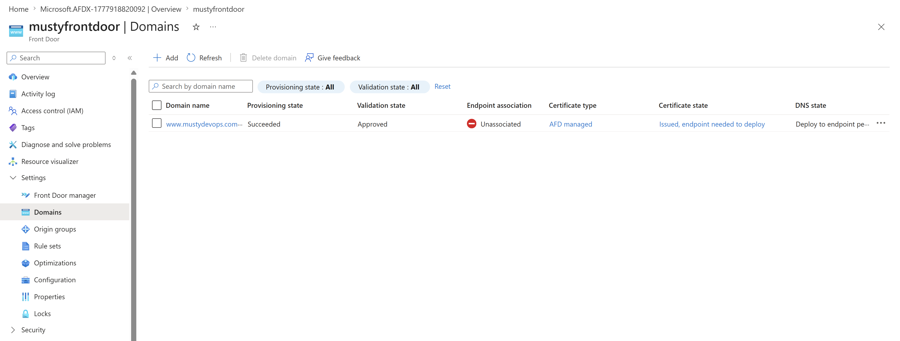

### Update the Front Door Routing Rule

1. In the Front Door resource, go to **Front Door Manager → Routes**
2. Click **Edit** on the default routing rule
3. Under **Domains**, select your validated custom domain (`www.mustydevops.com.ng`) from the dropdown
4. Ensure **Enable route** is ticked
5. Click **Update**

### Screenshot — Updated Route Configuration
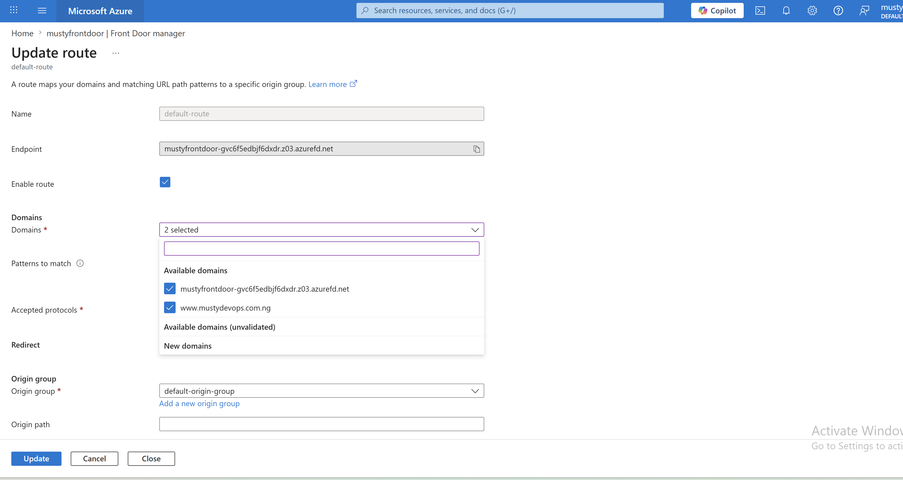

---

## Step 8 — Point Custom Domain to Front Door via CNAME

Add a **CNAME record** in your DNS to point the custom domain to the Front Door endpoint.

1. Log in to your domain registrar's DNS management panel
2. Add the following record:

| Field | Value |
|---|---|
| Host / Name | `www` |
| Type | `CNAME` |
| Value | `mustyfrontdoor.azurefd.net` |

3. Save the record

### Screenshot — CNAME Record in Domain Registrar
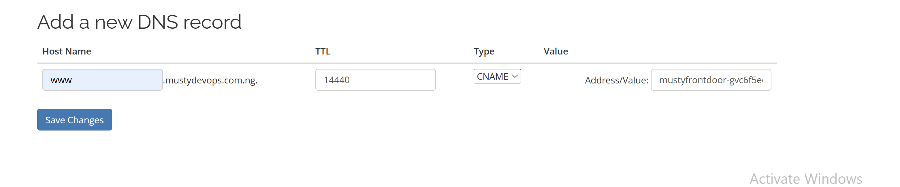

### Access Your Website via Custom Domain

Once DNS propagates, open your custom domain in the browser:

```
https://www.mustydevops.com.ng
```

### Screenshot — Website Live on Custom Domain
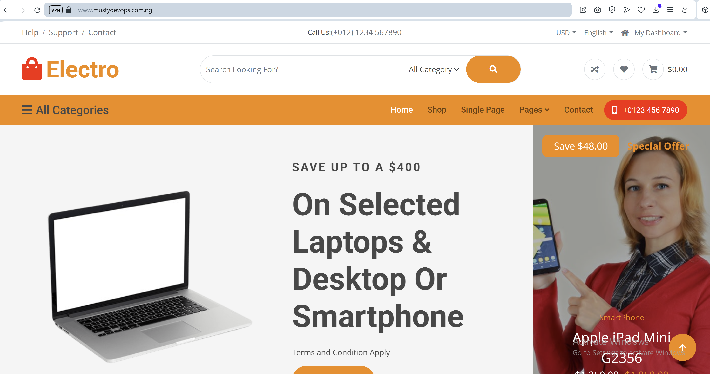

---

## Step 9 — Destroy Resources (Cleanup)

To avoid ongoing Azure charges after testing, delete all resources:

1. Go to **Azure Portal → Resource Groups**
2. Select `mustydev`
3. Click **Delete resource group**
4. Confirm by typing the resource group name

This removes the Storage Account, Front Door, and all associated resources in one action.

### Screenshot — Resources Deleted
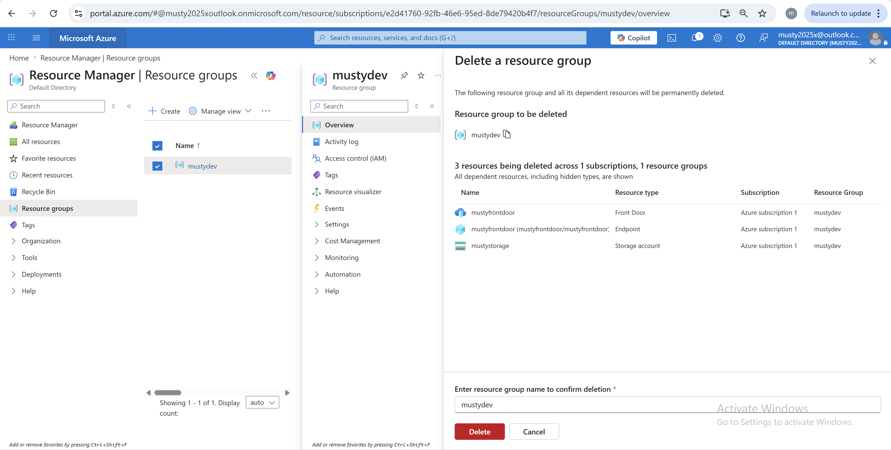

---

## Common Issues & Troubleshooting
- **Front Door Deployment Delays**: Front Door can take 20–40 minutes to fully deploy and propagate. If your website isn't accessible immediately, wait and try again.
- **Domain Validation Fails**: Ensure the TXT record is correctly added and has propagated.
- **HTTPS Not Working**: Front Door automatically provisions SSL certificates, but this can take time. If HTTPS isn't working, wait for the certificate to be issued.


## Project Summary

| Component | Resource Name | Purpose |
|---|---|---|
| Resource Group | `mustydev` | Container for all project resources |
| Storage Account | `mustystorage` | Hosts static website files in `$web` container |
| Static Website Endpoint | `mustystorage.z13.web.core.windows.net` | Direct Blob Storage URL |
| Front Door | `mustyfrontdoor` | Global CDN, HTTPS, and routing |
| Front Door Endpoint | `mustyfrontdoor.azurefd.net` | CDN-accelerated public URL |
| Custom Domain | `www.mustydevops.com.ng` | Production URL via CNAME |

---

## DNS Records Summary

| Type | Host | Value | Purpose |
|---|---|---|---|
| `TXT` | `_dnsauth` | `_ua1wvshon25z1rluwu4cj2g94z75j62` | Domain ownership verification for Front Door |
| `CNAME` | `www` | `mustyfrontdoor.azurefd.net` | Points custom domain to Front Door endpoint |

---

## Conclusion
This project successfully demonstrates how to host a static website on Azure Blob Storage, accelerate it with Azure Front Door, and serve it through a custom domain with HTTPS. By following these steps, you can create a scalable, secure, and globally accessible static website using Azure services.

